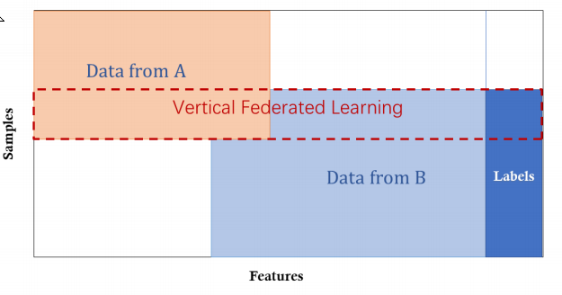
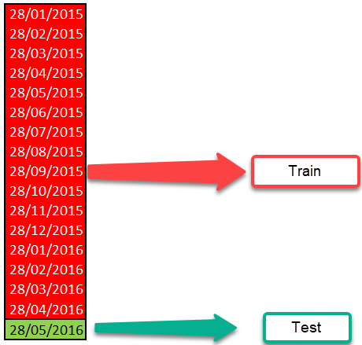
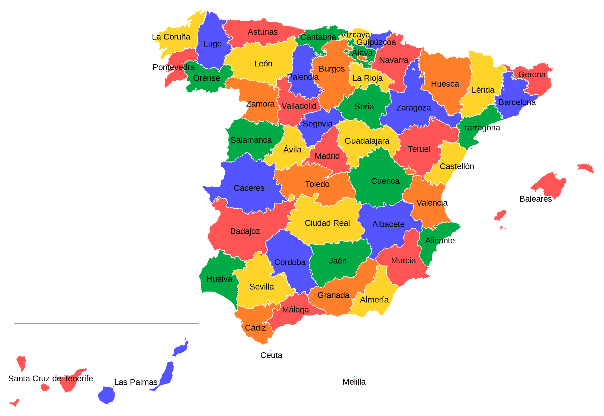

# Community Learning
> In diesem PoC wird anhand von Beispiel Daten der Federated Learning Ansatz aufgezeigt. Die Beispieldaten stammen von der Kaggle [Santander Product Recommendation](https://www.kaggle.com/c/santander-product-recommendation/data) Competition.


Hier ein Auszug von der Kaggle Website
> In this competition, you are provided with 1.5 years of customers behavior data from Santander bank to predict what new products customers will purchase. The data starts at 2015-01-28 and has monthly records of products a customer has, such as "credit card", "savings account", etc. You will predict what additional products a customer will get in the last month, 2016-06-28, in addition to what they already have at 2016-05-28. These products are the columns named:ind_(xyz)_ult1, which are the columns #25 - #48 in the training data. You will predict what a customer will buy in addition to what they already had at 2016-05-28. 

## Federated Learning (Theorie)
**Was ist Federated Learning?**
> Define $N$ data owners ${F1, ...FN }$, all of whom wish to train a machine learning model by consolidating their respective data ${D1, ...DN }$. A conventional method is to put all data together and use $D = D1 ∪ ... ∪ DN$ to train a model $M_{SUM}$ . A federated learning system is a learning process in which the data owners collaboratively train a model $M_{FED}$ , in which process any data owner $F_i$ does not expose its data $D_i$ to others. In addition, the accuracy of $M_{FED}$ , denoted as $V_{FED}$ should be very close to the performance of $M_{SUM}$ , $V_{SUM}$ . Formally, let $\delta$ be a non-negative real number, if 
$$| V_{FED} − V_{SUM} | < \delta$$ 
we say the federated learning algorithm has $\delta$-accuracy loss. [Yang, Federated Machine Learning:Concept and Applications (2019)](https://arxiv.org/abs/1902.04885)

Grundsätzlich gibt es 3 Arten von Federated Learning.


**Horizontal  Federated Learning**


**Vertical Federated Learning**


**Transfer Learning**


Ein Produktion Ready Federated Learning System müsste wie folgt aussehen. Doch das vorrangige Ziel ist es zu beweisen, dass wir bessere Ergebnisse erzielen, wenn Modelle gemeinsam trainiert werden, ohne dass ein Daten Austausch kommt. Deshalb wird in diesem PoC Federated Learning wie Distributed Maschine Learning Problem behandelt mit unterschiedlichen Data Owner. 


## Gradient Boosting Tree (Bsp. XGBoost)

Für die Umsetzung von Federated Learning verwenden wir XGBoost bzw. LightGBM. Beide sind Gradient Boosting Trees. Für all jene die einen refresher benötigen findet ihr [hier](https://www.youtube.com/watch?v=OtD8wVaFm6E) ein paar sehr informative Youtube Videos. Im Wesentlichen besteht XGBoost aus einer Serie von Decision Trees. Dabei ist jeder Tree in Reihe geschaltet und versucht die Residuen vom vorherigen Tree zu minimieren.  Stark vereinfacht funktioniert XGBoost wie folgt:

- berechne den Weighted Quantile Sketch: 
 - Hierzu wird lokal (in unserem Fall) die Distribution von jedem Feature berechnet und an den Parameterserver gesendet. 
 - Dieser wiederum approximiert die globale Distribution von jedem Feature und gibt, vor welche Splits geprüft werden müssen. 
- berechnen der Splits: Loakal werden nun die verschiedenen Splits berechnet für die verschiedenen Features. Die Resultate werden an den Parameterserver gesendet
- globales Modell: Nun wird anhand der Resultate ein globales Model aufgebaut und an die lokalen Nodes verteilt.
- nun wird mit Schritt 1 wieder begonnen.

## Machine Learning Problem
Wie weiter oben beschrieben ist das Ziel die zusätzlich gekauften Produkte im Monat vom 2016-06-28 zu bestimmen. Die Daten beinhalten Monatsdaten von 2015-01-28 - 2016-05-28 (ca. 1.5 Jahre). Nun gäbe es mehrere Möglichkeiten das ML Problem zu formulieren: 
- wir versuchen immer die gekauften Produkte des nächsten Monats zu bestimmen
- wir versuchen immer die gekauften Produkte für den Juni jeweils anhand des Vormonats zu bestimmen (ignorieren alle anderen Monate). 
- wir trainieren ein Recommender System mit allen Daten der Produkte und versuchen den letzten Monat vorherzusagen.

# Notebooks

## Notebooks 01_data_preprocess.ipynb und 02_data_Cleaning.ipynb
In den Notebooks **01_data_preprocess.ipynb** und **02_data_Cleaning.ipynb** werden die Daten aufbereitet. Da dieses Datenset recht gross ist, werden zuerst alle Daten in integer umgewandelt. Das Ziel ist es Floats- und Character Daten möglichst zu vermeiden, da diese den DataFrame unnötig aufblähen. Im Notebook 02 wird noch bei einzelnen Features die Nans ein wenig "smarter" bereinigt. 

## Notebook 03_features.ipynb 
Das Notebook **03_features.ipynb** macht mehrere Dinge. 
 - **Zielvariablen:** Das ML Problem lautet vorherzusagen, welche Produkte von einem Kunden im nächsten Monat zusätzlich erworben werden. Um dies festzustellen muss der aktuelle Monat mit dem Vormonat verglichen werden, um zu sehen ob ein neues Produkt erworben wurd.
 - **Produkt Features:** Neben den vorhandenen Features, macht es natürlich Sinn auch die Produkte selbst als Features zu definieren. Z.B. Kreditkarte Vormonat: hatte der Kunde im Vormonat eine Kreditkarte ist das eine wichtige Info. 
 - **reverse Dummy Variable:** Es ist natürlich möglich, für jedes Produkt einen Boosting Tree zu trainieren. Allerdings ist das nicht effizient. Im Prinzip handelt es sich um eine Classification-Problem. Wir wollen die Top 7 Produkte vorhersagen, wenn wir für jedes Produkt einen Boosting Tree entwerfen fehlt die Vergleichbarkeit und wir können keine Rangordnung festlegen. Darum wurden alle Produkte in einer Zielvariable ```y``` gespeichert. Wenn nun ein Kunde 2 Produkte erworben hat in einem Monat, so hat dieser zwei Zeilen in diesem Monat anstatt vorher eine Zeile.
 - **entfernen der Daten ohne neuem Produkt:** Ziel ist es die Top 7 Produkte vorzuschlagen. Daher macht es aus meiner Sicht keinen Sinn Einträge, ohne neuen Produkten, zu berücksichtigen zumal unsere Erfolg auch mit APK gemessen wird. 
 - **Train Test Split:**
Das Ziel dieser Kaggle Challenge ist es die neuen Produkte für die Periode 2016-06-28 vorherzusagen. Dazu haben sie das Datenset in ein Testset (Grunddaten von der Periode 2016-06-28) und Trainingset (Daten von 2015-01-28 bis 2016-05-28) aufgeteilt. Leider kennen wir die wahren Werte von dem Testset der Periode 2016-06-28 nicht, weshalb wir diesen Datenpunkt ignorieren werden und Train und Testset wie folgt aufteilen werden. 


## Notebook 04_base_model.ipynb
In diesem Notebook wird ein Basismodel bestimmt und evaluiert.

- **Trainieren:**
 Hierzu wird ein Standard XGBoost Model hergenommen und trainiert. Die erzielten Resultate lassen sich mit denen auf Kaggle vergleichen. 

- **Evaluierung vom Testset:**

 Für die [Evaluierung](https://www.kaggle.com/c/santander-product-recommendation/overview/evaluation) wird der Mean Average Precision @ 7 (MAP@7) hergenommen. Die untenstehenden Formel haben wir uns von [jturkewitz](https://github.com/jturkewitz/SideProjects/blob/4c437b02d5e017636c84cc22eb3ff71f8eea1308/Kaggle/Santander_Prod/santander_prod.py#L272) ausgeliehen. [Hier](http://sdsawtelle.github.io/blog/output/mean-average-precision-MAP-for-recommender-systems.html) noch eine gute Erklärung. 

$$
MAP@7 =  \dfrac{1} {\vert U \vert} \sum^{\vert U \vert}_{u=1} \dfrac {1} {min(m,7)} \sum^{min(n,7)}_{k=1} P(k)
$$

## Notebook 05_xgboost_simple_ensemble.ipynb

- **Aufteilen der Daten**
Um die Daten möglichst konsistent zu teilen, werden wir für jede Kundenid den ursprünglichen Wohnort ermitteln. Wenn nun ein Kunde die Region in dem Untersuchungszeitraum wechselt, so wird nur der ursprüngliche Wohnort ausgewertet. So können wir sicherstellen, dass wir keine Daten durch die Aufteilung verlieren. In dem Bild weiter unten sind die verschiedenen Regionen zu sehen. Wir werden versuchen Spanien in nördliche und südliche Regionen aufzuteilen.


- **Berechnung von einem Ensemble:**
Nachdem wir die Daten in einen Region-Süd und in eine Region-Nord aufgeteilt haben. Trainieren wir jeweils ein Model mit den jeweiligen Daten. 

## 06_Distributed_ML.ipynb

Hierfür baute ich einen Cluster aus drei Cotnainern welche mittels OpenMPI (Message Passing Library) miteinander kommunzieren. Hierfür musste LightGBM (MPI Version kompiliert werden). Der Cluster besteht aus 1 Head Node und 2 Compute Nodes. Der eine Node bekam die Daten von Region Süd und der andere von der Region Nord.

# Summary


Wir konnten feststellen, dass moderne Algorithmen wie XGBoost und LightGBM geeignet sind für Federated Learning. In der einfachsten Umstzung als Distributed Learning Algorithmen ergab sich jedoch kein eindeutiger Mehrwert. Dennoch bin ich überzeugt, das bei gewissen ML Modellen es durchaus Sinn macht die Daten zu teilen und einen Federated Learning Ansatz (Distributet Learning) zu wählen. 

Obwohl in diesem Beispiel der Mehrwert nicht eindeutig ist, könnte ich mir einen Mehrwert bei Customer Churn vorstellen. Hierzu wäre z.B. https://www.kaggle.com/c/kkbox-churn-prediction-challenge/data oder https://www.kaggle.com/blastchar/telco-customer-churn.

```python
import pandas as pd
df = pd.read_csv('data/final/results_df.csv', index_col=0)
df
```


<div>
<style scoped>
    .dataframe tbody tr th:only-of-type {
        vertical-align: middle;
    }

    .dataframe tbody tr th {
        vertical-align: top;
    }

    .dataframe thead th {
        text-align: right;
    }
</style>
<table border="1" class="dataframe">
  <thead>
    <tr style="text-align: right;">
      <th></th>
      <th>model_south</th>
      <th>model_north</th>
      <th>model_all</th>
      <th>model_south_north_combine</th>
      <th>distributed_lgbm_training</th>
    </tr>
  </thead>
  <tbody>
    <tr>
      <th>test_south</th>
      <td>0.026727</td>
      <td>0.026502</td>
      <td>0.026690</td>
      <td>0.026649</td>
      <td>0.026444</td>
    </tr>
    <tr>
      <th>test_north</th>
      <td>0.017951</td>
      <td>0.018017</td>
      <td>0.017983</td>
      <td>0.018006</td>
      <td>0.017836</td>
    </tr>
    <tr>
      <th>test</th>
      <td>0.023006</td>
      <td>0.022904</td>
      <td>0.022998</td>
      <td>0.022984</td>
      <td>0.022794</td>
    </tr>
  </tbody>
</table>
</div>


# Offene Fragen

 - 

# How to use
In order to test it do the following:
1. (optional) I strongly recommend to create an environment with virtualenv or conda 
2. Clone this repo
3. run ```python setup.py install``` to install all needed libraries
4. next you can run the ```jupyter notebook``` and call the displayed URL

